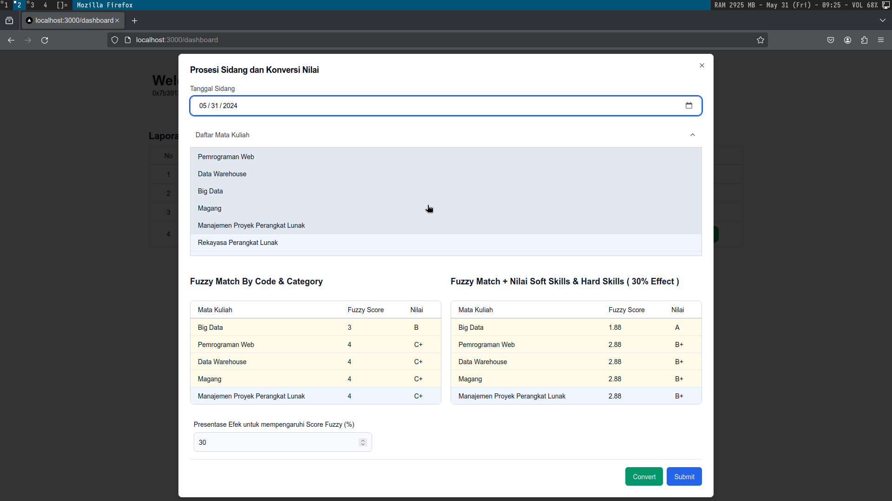
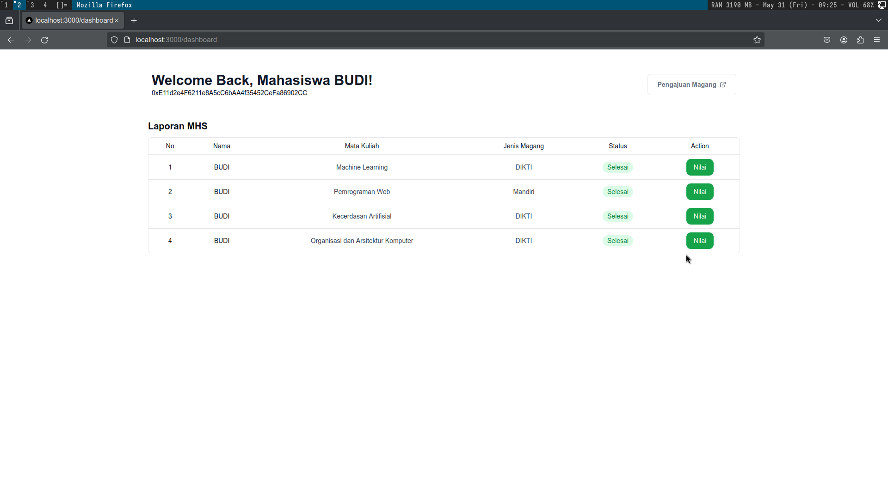

# Notes
### dahsboard_mhs.png
Ini adalah tampilan dashboard Mahasiswa setelah login dan hanya menampilkan data pemililik wallet itu sendiri.


### dashboard_admin.png
Ini adalah tampilan dashboard Admin setelah login dan menampilkan semua data berbagai mahasiswa yang terdaftar dan mengajukan Magang.
(  mengajukan Magang maka dianggap sebuah transaksi  ).

### pengajuan_magang_step_1.png
Ini adalah Proses awal pengajuan magang dari dashboard mahasiwa ketika di klik Pengajuan Magang .


### pengajuan_magang_step_1_done.png.png
Ini adalah tampilan dashboard Mahasiswa setelah selesai proses pertama pengajuan magang dan
menunggu approve dari admin untuk proses selanjutnya.


### pengajuan_magang_step_2.png
Ini adalah Proses kedua pengajuan magang dari dashboard admin setelah ada mahasiswa yang mengajukan
magang


### pengajuan_magang_step_2_done.png
Ini adalah tampilan dashboard Admin setelah selesai di approve admin. kemudian proses selanjutnya
menunggu mahasiswa melanjutkan proses selanjutnya


### pengajuan_magang_step_3.png
Ini adalah Proses ketiga pengajuan magang dari dashboard mahasiswa setelah di approve admin


### pengajuan_magang_step_4.png
Ini adalah Proses keempat pengajuan magang dari dashboard admin setelah  mahasiswa melakukan step 3


### pengajuan_magang_step_5_nilailaporan.png
Ini adalah Proses kelima pengajuan magang dari dashboard mahasiswa setelah selesai proses magang
dimana di haruskan mengisi nilai Hardskills dan Softskills


### pengajuan_magang_step_6_fuzz_nilai.png
Ini adalah Proses keenam pengajuan magang dari dashboard admin setelah  mahasiswa mengisi laporan
nilainya dimana nilai ini di gunakan untuk kalkulasi Nilai Magang


### dashboard_mhs_done_magang.png
Ini adalah tampilan dashboard Mahasiswa dengan status selesai dimana mahasiswa bisa melihat Nilainya.


### view_nilai_mahasiswa_dashboard_mhs.png
Ini adalah aksi dari dashboard_mhs_done_magang ketika di klik view


### ganace_view_contract_deployed.png
Ini adalah tampilan kontrak yang sudah di deploy ke Ganache .


### ganache_view_add_data.png
Ini adalah salah satu tampilan proses transaksi yang tercatat di Ganache ( yaitu ketika mahasiswa )


## Alur Kerja
1. Mahasiswa mengajukan magang. - pengajuan_magang_step_1.
2. Admin melakukan approve / reject ( jika reject maka proses tidak akan berlanjut ) - pengajuan_magang_step_2.
3. Jika di approve admin mahasiswa melakukan proses selanjutnya yaitu pengajuan_magang_step_3.
4. Admin melakukan validasi ( supaya proses bisa berlanjut ) - pengajuan_magang_step_4.
5. Mahasiswa kemudian mengisi nilai Softskills dan Hardskills - pengajuan_magang_step_5_nilailaporan.
6. Admin kemudian mengisi tanggal sidang dan memilih matakuliah mahasiswa yang ingi di convert nilainya - pengajuan_magang_step_6_fuzz_nilai.
7. kemudian Mahasiswa bisa melihat nilainya di dashboard_mhs_done_magang .


## Tutorial 

First, run the development server:

```bash
# Clone 
git clone https://github.com/hudamnhd/scf_min

# install dependencies
npm install -g truffle
npm install

# Open Ganache app 

# compile and deploy contract
truffle migrage

# fill data contract
node fill.js

# run
npm run dev
```
